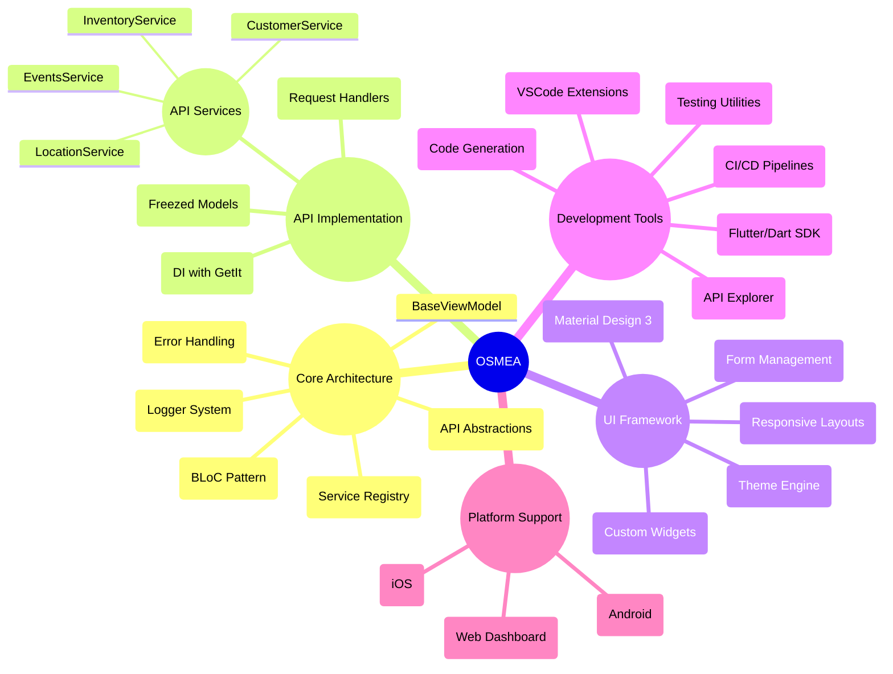
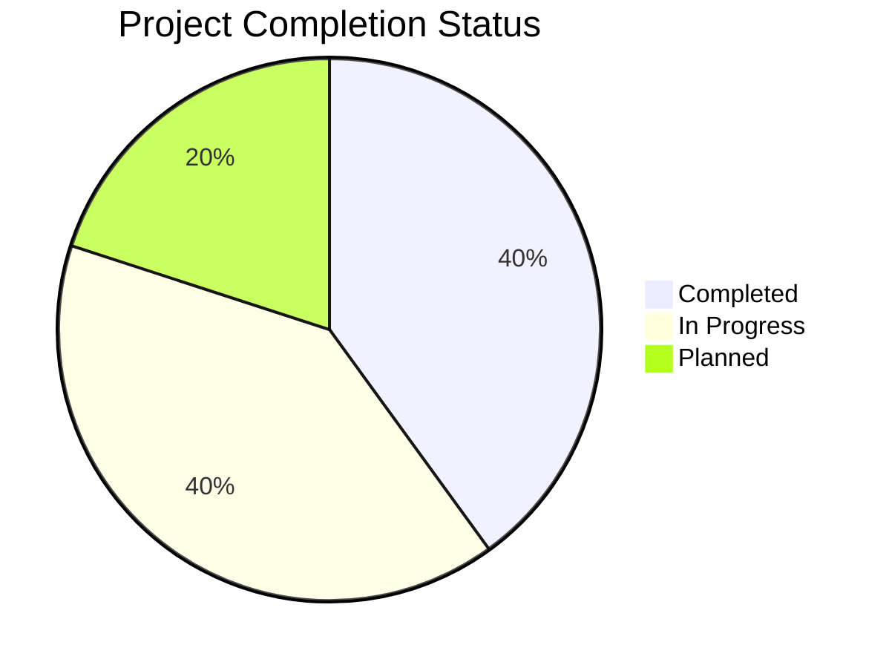
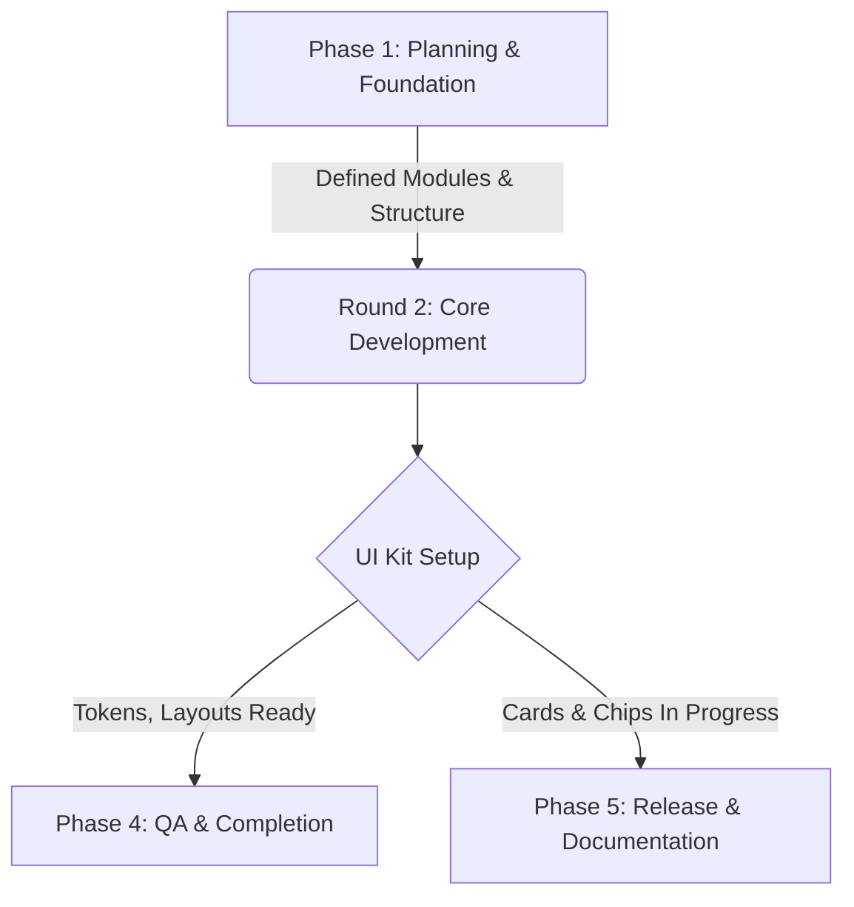

# OSMEA ®️
<div align="center">

[](https://github.com/masterfabric-mobile/osmea)
[](https://github.com/masterfabric-mobile/osmea/blob/dev/LICENSE)
[](https://flutter.dev)
[](https://shopify.dev/docs/api)
[](https://woocommerce.com/documentation/)
[](https://github.com/masterfabric-mobile/osmea/graphs/contributors)
[](https://github.com/masterfabric-mobile/osmea/stargazers)
[](https://github.com/masterfabric-mobile/osmea/watchers)
[](https://github.com/masterfabric-mobile/osmea/commits)
[](https://github.com/masterfabric-mobile/osmea/pulls?q=is%3Apr+is%3Aclosed)
</div>

<div align="center">

  
  **"Building the future of mobile e-commerce, one component at a time."**
</div>

## 🌟 Vision & Mission

> ### 🎯 **Vision**
> 🧭 *To build a sustainable, functional, and reusable mobile architecture for the future of e-commerce applications.*
> ### 🚀 **Mission**
> We are committed to empowering developers and product teams by:
> - 🛠️ Providing a robust, modular codebase for rapid development  
> - 🎯 Enabling scalable architecture adaptable to diverse use cases  
> - 📚 Delivering fully documented, production-ready components  

---

## 💡 Why Choose OSMEA?

> **OSMEA is not just a framework — it’s an ecosystem.**  
> Build scalable, customizable, and cross-platform e-commerce apps using Flutter.  
> Designed for integration with **Shopify**, **WooCommerce**, or **custom APIs**.

---

### ✅ What Makes OSMEA Unique?

```
━━━━━━━━━━━━━━━━━━━━━━━━━━━━━━━━━━━━━━━━━━
🔥  PLATFORM AGNOSTIC
━━━━━━━━━━━━━━━━━━━━━━━━━━━━━━━━━━━━━━━━━━
→ Connects with Shopify, WooCommerce 
→ RESTful by design — headless friendly

━━━━━━━━━━━━━━━━━━━━━━━━━━━━━━━━━━━━━━━━━━
🧱  MODULAR & COMPOSABLE
━━━━━━━━━━━━━━━━━━━━━━━━━━━━━━━━━━━━━━━━━━
→ Each module is plug & play  
→ Build only what you need. No bloat.

━━━━━━━━━━━━━━━━━━━━━━━━━━━━━━━━━━━━━━━━━━
🚀  ENTERPRISE-READY
━━━━━━━━━━━━━━━━━━━━━━━━━━━━━━━━━━━━━━━━━━
→ CI/CD pipelines, test coverage, versioning  
→ Built for scale. Not a toy framework.

━━━━━━━━━━━━━━━━━━━━━━━━━━━━━━━━━━━━━━━━━━
🎨  THEMEABLE & CUSTOMIZABLE
━━━━━━━━━━━━━━━━━━━━━━━━━━━━━━━━━━━━━━━━━━
→ Complete UI kit: Text, Colors, Buttons, Cards  
→ Override everything. Your brand, your rules.

━━━━━━━━━━━━━━━━━━━━━━━━━━━━━━━━━━━━━━━━━━
📱  CROSS-PLATFORM
━━━━━━━━━━━━━━━━━━━━━━━━━━━━━━━━━━━━━━━━━━
→ Flutter-powered single codebase  
→ Native look & performance on iOS & Android

━━━━━━━━━━━━━━━━━━━━━━━━━━━━━━━━━━━━━━━━━━
🔐  SECURE & SCALABLE
━━━━━━━━━━━━━━━━━━━━━━━━━━━━━━━━━━━━━━━━━━
→ Role-based access, modular APIs  
→ Built with Clean Architecture & async-safety

```

---

### 🛠️ Built For

- ✅ **Startups** building fast MVPs  
- ✅ **Agencies** managing multiple client storefronts  
- ✅ **Enterprises** with modular architecture needs  
- ✅ **Open-source contributors** ready to innovate

---

> 💬 *“Code once, scale everywhere. OSMEA simplifies the hardest parts of mobile commerce.”*

---

## 🏗️ Architecture Overview



---

## 📦 Project Structure

```bash
osmea/
├── lib/
│   ├── core/              # Core models and API services
│   │   ├── models/        # Data models and entities
│   │   ├── services/      # API services and repositories
│   │   └── utils/         # Utility functions and helpers
│   ├── features/          # Feature-specific modules
│   │   ├── access/        # Authentication and access control
│   │   ├── billing/       # Payment and billing systems
│   │   ├── customers/     # Customer management
│   │   ├── orders/        # Order processing
│   │   ├── products/      # Product catalog
│   │   └── inventory/     # Stock management
│   ├── ui/                # UI components and widgets
│   │   ├── components/    # Reusable UI components
│   │   ├── layouts/       # Layout utilities
│   │   └── themes/        # Design system and themes
│   └── shared/            # Shared definitions and utilities
├── assets/                # Images, icons, fonts
├── test/                  # Unit and widget test files
├── docs/                  # Documentation and guides
├── pubspec.yaml           # Dependencies and project metadata
└── README.md              # Primary documentation
```

---

## 🛠️ Features

<details>
<summary>🔌 <strong>Platform Integration</strong></summary>

- ✅ **Multi-Platform Support**: Shopify, WooCommerce, BigCommerce  
- ✅ **Unified API Layer**: Consistent interface across platforms  
- ✅ **Authentication**: OAuth 2.0 and API key support  
- ✅ **Webhook Management**: Event-driven architecture  
- ✅ **Rate Limiting**: Smart request throttling  

</details>

<details>
<summary>📱 <strong>Mobile Experience</strong></summary>

- ✅ **Cross-Platform**: iOS & Android from a single codebase  
- ✅ **Material Design 3**: Modern UI components  
- ✅ **Responsive Layouts**: Works on all screen sizes  
- ✅ **Theme System**: Dynamic color and style customization  
- 🔄 **Offline Support**: Core functionality without internet *(In Progress)*  

</details>

<details>
<summary>🛍️ <strong>E-commerce Features</strong></summary>

- ✅ **Product Catalog**: Browsing, search, filtering  
- ✅ **Cart & Checkout**: Streamlined purchase flow  
- ✅ **Payment Integration**: Multiple gateway support  
- ✅ **User Accounts**: Registration, profiles, wishlists  
- ✅ **Order Management**: History, tracking, reordering  

</details>

<details>
<summary>🧰 <strong>Developer Tools</strong></summary>

- 📋 **CLI Toolkit**: Rapid scaffolding and generators *(Planned)*  
- 🔄 **Live Reload**: Instant feedback during development *(In Progress)*  
- 📋 **Asset Generation**: Auto-create icons and splash screens *(Planned)*  
- ✅ **Testing Suite**: Unit, widget, and integration tests  
- 📋 **CI/CD Templates**: GitHub Actions and fastlane setup *(Planned)*  

</details>

---

## 📊 Project Progress Overview

<div align="center">

---
all Progress: **40%** Complete

</div>



### 🚀 ** System: 

🚀 Core System Modules 

<details>
<summary><strong>All 12 core modules are fully implemented and production-ready</strong></summary>


  •	✅ Authentication & Access
  •	✅ Billing & Payments
  •	✅ Customer Management
  •	✅ Order Processing
  •	✅ Product Catalog
  •	✅ Inventory Control
  •	✅ Discounts & Promotions
  •	✅ Event System
  •	✅ Gift Cards
  •	✅ Marketing Events
  •	✅ Transactions
  •	✅ Webhooks

</details>


⸻

🎨 UI Components

<details>
<summary><strong>Core design system and foundational widgets are ready</strong></summary>


  •	✅ Typography
  •	✅ Colors & Theme
  •	✅ Buttons
  •	✅ Forms & Inputs
  •	✅ Navigation Components
  •	🔄 Cards & Chips (in development)
  •	📋 Dialogs, Menus, Upload, Carousel (up next)

</details>


⸻

📱 User Experience

<details>
<summary><strong>Main user flows are implemented and functional</strong></summary>


  •	✅ Navigation
  •	✅ Authentication Flow
  •	✅ Product Browsing
  •	✅ Shopping Cart & Checkout
  •	✅ User Profiles
  •	🔄 Advanced Search, Wishlist, Notifications (in progress)

</details>


⸻

🔧 Developer Experience

<details>
<summary><strong>Developer tooling and project structure are established</strong></summary>


  •	✅ Project Structure
  •	✅ State Management
  •	✅ API Layer & Services
  •	✅ Testing Suite
  •	✅ Documentation
  •	📋 CLI Tools, CI/CD, Asset Generation (planned)

</details>


---

## 🗓️ Project Timeline & Roadmap


---

> 🙏 **Special Thanks**: A huge appreciation to all contributors who helped build and improve this project! For the complete list, visit our [Contributors Page](https://github.com/masterfabric-mobile/osmea/graphs/contributors).

---

## 🚀 Getting Started

### Prerequisites

- Flutter SDK (3.0+)
- Dart SDK (3.0+)
- Android Studio / VS Code
- Git

### Quick Start

```bash
# Clone the repository
git clone https://github.com/masterfabric-mobile/osmea.git

# Navigate to project directory
cd osmea

# Install dependencies
flutter pub get

# Run the app
flutter run
```

### Development Setup

```bash
# Generate code (models, routes, etc.)
flutter packages pub run build_runner build

# Run tests
flutter test

# Build for production
flutter build apk --release  # Android
flutter build ios --release  # iOS
```

---

## 🤝 Contributing

We welcome contributions from the community! Here's how you can help:

### How to Contribute

1. **Fork the Repository**
   ```bash
   git fork https://github.com/masterfabric-mobile/osmea.git
   ```

2. **Create a Feature Branch**
   ```bash
   git checkout -b feature/amazing-feature
   ```

3. **Make Your Changes**
   - Follow our coding standards
   - Write tests for new features
   - Update documentation

4. **Submit a Pull Request**
   - [Create a Pull Request](https://github.com/masterfabric-mobile/osmea/pulls)
   - Provide a clear description
   - Link related issues

### Current Opportunities

Check out our [Issues](https://github.com/masterfabric-mobile/osmea/issues) for:
- 🐛 **Bug Reports**: Help us fix issues
- ✨ **Feature Requests**: Suggest new features
- 📚 **Documentation**: Improve our docs
- 🎨 **UI Components**: Build new components

### Development Guidelines

- **Code Style**: Follow Dart/Flutter conventions
- **Testing**: Write unit tests for new features
- **Documentation**: Update docs for API changes
- **Commit Messages**: Use conventional commits

---

## 📄 License

> 🔐 **License:** GNU AGPL v3.0  
> 📜 This project is protected under the **GNU Affero General Public License v3.0**.  
> If you modify and deploy this project publicly, you must also **publish your changes** under the same license.

📎 Full details available in the [`LICENSE`](https://github.com/masterfabric-mobile/osmea/blob/dev/LICENSE) file.

---

<div align="center">

### 🚀 **[Try Live Demo →](https://osmea-app.web.app)**

Experience all components in action with our interactive demo application.

</div>

---

<div align="center">

**Built with ❤️ by the OSMEA Team**

© 2025 MasterFabric Mobile • Maintained by the OSMEA Engineering Team

[⬆ Back to Top](#osmea-️)

</div>