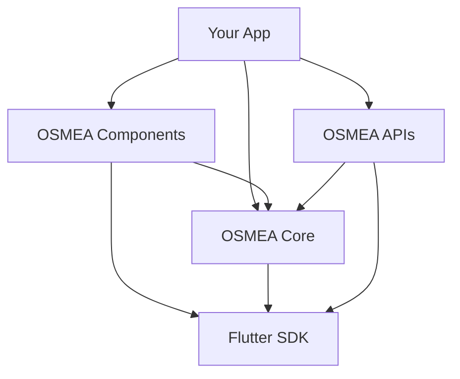

# 📦 OSMEA Packages

<div align="center">

[](https://github.com/masterfabric-mobile/osmea)
[](https://flutter.dev)
[](https://dart.dev)
[](LICENSE)

**A comprehensive Flutter ecosystem for building modern, scalable applications**

[🚀 Get Started](https://github.com/masterfabric-mobile/osmea#readme) • [📚 Documentation](https://github.com/masterfabric-mobile/osmea/tree/dev/docs) • [🐛 Report Issues](https://github.com/masterfabric-mobile/osmea/issues)

</div>

---

## 🌟 Overview

The **OSMEA Packages** is a modular Flutter ecosystem designed to provide developers with a complete toolkit for building modern, scalable applications. Each package is carefully crafted to work seamlessly together while maintaining independence and flexibility.

### 🎯 Design Philosophy

- **🔄 Modular Architecture**: Each package is self-contained and can be used independently
- **⚡ Performance First**: Optimized for speed and efficiency
- **🎨 Design System**: Consistent UI/UX across all components
- **🔧 Developer Experience**: Intuitive APIs and comprehensive documentation
- **📱 Cross-Platform**: Full support for iOS, Android, Web, and Desktop

---

## 📦 Available Packages

### 🎨 [OSMEA Components](packages/components/)

<div align="center">

[](packages/components/)
[](packages/components/pubspec.yaml)
[](https://osmea-app.web.app)

</div>

**A comprehensive UI component library for building beautiful, accessible Flutter applications.**

#### ✨ Key Features
- **🎨 45+ UI Components**: Buttons, forms, layouts, navigation, dynamic, and more
- **📱 Responsive Design**: Mobile-first approach with adaptive layouts
- **🎯 Type Safety**: Full TypeScript-like type safety with Dart
- **🔧 Customization**: Extensive theming and styling options

#### 📋 Component Categories
- **Basic**: Buttons, Text, Badges, Avatars, Cards, Chips
- **Forms**: Input fields, Checkboxes, Radio buttons, Switches, Dropdowns
- **Layout**: Containers, Grid system, Spacing, Alignment, Flexible layouts
- **Navigation**: App bars, Navigation bars, Tab bars, Bottom sheets
- **Dynamic**: Loading indicators, Toast notifications, Progress bars
- **Advanced**: Carousels, Search bars, Rich text, Color pickers

#### 🚀 Quick Start
```yaml
dependencies:
  osmea_components:
    git:
      url: https://github.com/masterfabric-mobile/osmea.git
      path: packages/components
```

#### 📚 Learn More
- **[📖 Full Documentation](packages/components/README.md)** - Complete component reference
- **[🎮 Live Demo](https://osmea-app.web.app)** - Interactive playground
- **[📱 Example App](packages/components/example_mobile/)** - Real-world implementation
- **[🎨 Storybook](packages/components/example_storybook/)** - Component showcase

---

### 🔧 [OSMEA Core](packages/core/)

<div align="center">

[](packages/core/)
[](packages/core/pubspec.yaml)

</div>

**The foundation package providing essential utilities, base classes, and shared logic for OSMEA applications.**

#### ✨ Key Features
- **🏗️ Base Architecture**: Core classes and interfaces for consistent app structure
- **🌐 Internationalization**: Multi-language support with slang
- **💾 Data Management**: Local storage, database, and preferences
- **📊 Analytics**: Firebase analytics integration
- **🔧 Dependency Injection**: Injectable-based DI system
- **📱 Device Information**: Platform-specific utilities and device info
- **🛣️ Routing**: GoRouter-based navigation system
- **📝 Logging**: Structured logging with different levels

#### 📋 Core Modules
- **Base Classes**: Abstract classes for common patterns
- **Configuration**: App configuration and environment management
- **Dependency Injection**: Service locator and DI container
- **Localization**: i18n support with slang
- **Storage**: Shared preferences and SQLite database
- **Analytics**: Firebase analytics and custom event tracking
- **Device Utils**: Platform detection and device information
- **Routing**: Navigation and route management

#### 🚀 Quick Start
```yaml
dependencies:
  core:
    git:
      url: https://github.com/masterfabric-mobile/osmea.git
      path: packages/core
```

#### 📚 Learn More
- **[📖 Documentation](packages/core/README.md)** - Core utilities guide
- **[🔧 Example App](packages/core/example/)** - Implementation examples
- **[🌐 i18n Setup](packages/core/assets/i18n/)** - Localization examples

---

### 🌐 [OSMEA APIs](packages/apis/)

<div align="center">

[](packages/apis/)
[](packages/apis/pubspec.yaml)

</div>

**A robust network layer for handling RESTful API requests and responses with Shopify integration.**

#### ✨ Key Features
- **🛒 Shopify Integration**: Complete Storefront and Admin API support
- **🌐 RESTful APIs**: Standardized API communication patterns
- **🔄 Retry Logic**: Automatic retry mechanisms for failed requests
- **🍪 Cookie Management**: Session and authentication handling
- **📝 Request/Response Logging**: Comprehensive network debugging
- **🔧 Dependency Injection**: Injectable-based service architecture
- **📦 Code Generation**: Freezed and JSON serialization
- **🛡️ Error Handling**: Robust error management and recovery

#### 📋 API Modules
- **Storefront APIs**: Customer-facing e-commerce operations
- **Admin APIs**: Backend management and administration
- **Authentication**: OAuth and session management
- **File Management**: Upload and download utilities
- **Caching**: Request caching and optimization
- **Interceptors**: Request/response modification
- **Error Handling**: Standardized error responses

#### 🚀 Quick Start
```yaml
dependencies:
  apis:
    git:
      url: https://github.com/masterfabric-mobile/osmea.git
      path: packages/apis
```

#### 📚 Learn More
- **[📖 Documentation](packages/apis/README.md)** - API integration guide
- **[🔧 Example App](packages/apis/example/)** - API usage examples
- **[🛒 Shopify APIs](packages/apis/lib/network/remote/)** - Available endpoints

---

## 🏗️ Architecture Overview

### 📊 Package Dependencies



### 🔄 Integration Patterns

#### **Basic Integration**
```dart
import 'package:osmea_components/osmea_components.dart';
import 'package:core/core.dart';
import 'package:apis/apis.dart';

void main() {
  // Initialize core services
  await configureDependencies();
  
  // Start your app
  runApp(MyApp());
}
```

#### **Component Usage**
```dart
// Use OSMEA components
OsmeaComponents.button(
  text: 'Click Me',
  variant: ButtonVariant.primary,
  onPressed: () async {
    // Use core services
    final analytics = getIt<AnalyticsService>();
    analytics.trackEvent('button_clicked');
    
    // Make API calls
    final apiService = getIt<ShopifyApiService>();
    final products = await apiService.getProducts();
  },
)
```

---

## 🚀 Getting Started

### 📋 Prerequisites

- **Flutter SDK** (3.19.0 or higher)
- **Dart SDK** (2.17.0 or higher)
- **Git** for version control

### 🔧 Installation

#### **1. Add Dependencies**

Add the packages you need to your `pubspec.yaml`:

```yaml
dependencies:
  flutter:
    sdk: flutter
  
  # UI Components
  osmea_components:
    git:
      url: https://github.com/masterfabric-mobile/osmea.git
      path: packages/components
  
  # Core utilities
  core:
    git:
      url: https://github.com/masterfabric-mobile/osmea.git
      path: packages/core
  
  # API layer
  apis:
    git:
      url: https://github.com/masterfabric-mobile/osmea.git
      path: packages/apis
```

#### **2. Install Dependencies**
```bash
flutter pub get
```

#### **3. Initialize Services**
```dart
import 'package:core/core.dart';

void main() async {
  WidgetsFlutterBinding.ensureInitialized();
  
  // Configure dependency injection
  await configureDependencies();
  
  runApp(MyApp());
}
```


## 🎯 Use Cases

### 🛒 E-commerce Applications
- **Components**: Product cards, shopping carts, checkout forms
- **Core**: User management, analytics, localization
- **APIs**: Shopify integration, payment processing

### 📱 Mobile Apps
- **Components**: Navigation, forms, feedback components
- **Core**: Device utilities, storage, routing
- **APIs**: Backend communication, data synchronization

### 🌐 Web Applications
- **Components**: Responsive layouts, interactive elements
- **Core**: Browser utilities, session management
- **APIs**: RESTful API communication

### 🖥️ Desktop Applications
- **Components**: Desktop-optimized UI components
- **Core**: Platform-specific utilities
- **APIs**: Local and remote data management

---

## 🔧 Development

### 📦 Local Development

#### **Clone and Setup**
```bash
# Clone the repository
git clone https://github.com/masterfabric-mobile/osmea.git
cd osmea

# Install dependencies for all packages
flutter pub get
cd packages/components && flutter pub get
cd ../core && flutter pub get
cd ../apis && flutter pub get
```

#### **Run Examples**
```bash
# Components example app
cd packages/components/example_mobile
flutter run

# Core example
cd packages/core/example
flutter run

# APIs example
cd packages/apis/example
flutter run
```

### 📝 Code Generation

#### **Generate Code**
```bash
# Components
cd packages/components
flutter packages pub run build_runner build

# Core
cd packages/core
flutter packages pub run build_runner build

# APIs
cd packages/apis
flutter packages pub run build_runner build
```

---

## 📚 Documentation

### 📖 Package Documentation

- **[🎨 Components Guide](packages/components/README.md)** - Complete UI component reference
- **[🔧 Core Guide](packages/core/README.md)** - Core utilities and services
- **[🌐 APIs Guide](packages/apis/README.md)** - Network layer and API integration

### 🎓 Tutorials & Examples

- **[📱 Mobile Example](packages/components/example_mobile/)** - Real-world mobile app
- **[🎨 Storybook](packages/components/example_storybook/)** - Interactive component showcase
- **[🔧 Core Examples](packages/core/example/)** - Core utilities usage
- **[🌐 API Examples](packages/apis/example/)** - API integration patterns

### 🛠️ Development Resources

- **[📋 Contributing Guide](../CONTRIBUTING.md)** - How to contribute
- **[🐛 Issue Tracker](https://github.com/masterfabric-mobile/osmea/issues)** - Report bugs and request features
- **[📄 License](../LICENSE)** - Project license information

---

## 🤝 Contributing

We welcome contributions! Here's how you can help:

### 🐛 Reporting Issues
1. Check existing issues first
2. Create a new issue with detailed information
3. Include steps to reproduce
4. Add screenshots if applicable

### 💡 Suggesting Features
1. Open a feature request issue
2. Describe the use case
3. Provide mockups if possible
4. Discuss implementation approach

### 🔧 Code Contributions
1. Fork the repository
2. Create a feature branch
3. Make your changes
4. Add tests if applicable
5. Submit a pull request

### 📋 Contribution Guidelines
- Follow Dart/Flutter style guidelines
- Write clear commit messages
- Add documentation for new features
- Ensure all tests pass
- Update examples if needed

---

## 📄 License

<div align="center">

> 🔐 **License:** GNU AGPL v3.0  
> 📜 This project is protected under the **GNU Affero General Public License v3.0**.  
> If you modify and deploy this project publicly, you must also **publish your changes** under the same license.

📎 Full details available in the [`LICENSE`](../LICENSE) file.

</div>

---

## 🙏 Acknowledgments

- **Flutter Team** - For the amazing framework
- **Dart Team** - For the powerful language
- **Shopify** - For the comprehensive e-commerce APIs
- **OSMEA Contributors** - For building this ecosystem
- **Open Source Community** - For inspiration and support

---

<div align="center">

**Built with ❤️ by the OSMEA Team**

© 2025 MasterFabric Mobile • Maintained by the OSMEA Engineering Team


</div>
